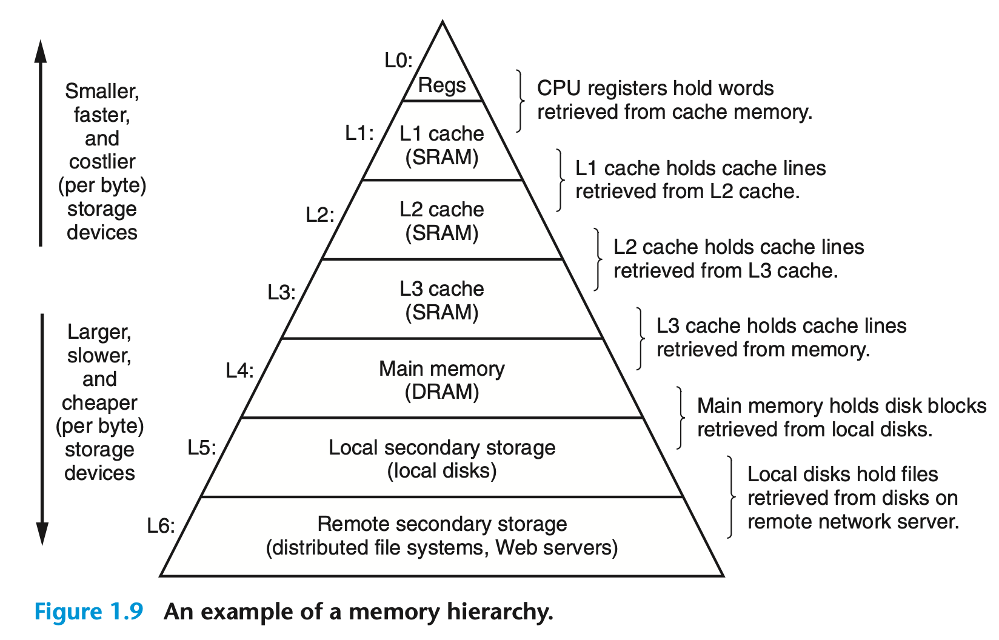
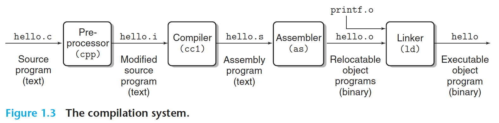

# CS:APP

## Chapter 1: A Tour of Computer Systems

### Quotes
> Information is Bits + Contexts

> All information in a system—including disk files, programs stored in memory, user data stored in memory, and data transferred across a network—is represented as a bunch of bits.

> A file is a sequence of bytes, nothing more and nothing less.

### Notes
- The chapter walks through hello world from a system's POV.
- Test: what do I think happens?
    - we go from text to code
- compilation is what's between source code and machine code
- word size is a fundamental system parameter (32bit vs 64bit)

The only thing that distinguishes different data objects is the context in which we view them."

Why are smaller, faster storage devices constlier per byte?
- Put simply, more resources are devoted to them. More transistors are used in the these caches. These can live in the CPU chip itself which also is very constrained real-estate.
- OS is the software between your apps and the hardware
- Ahmdal's Law: Your app or process is constrained by the percentage of it that is not parallelizable

## Chapter 2: Representing and Manipulating Information

- bitwise and logical operators
- representing negative integers
    - most common approach is using two's complement
        - the most significant bit is negative

## Chapter 3: Machine-Level Representation of Programs

qs
- how is moores law holding up in 2026? 
- draw out compilation process at a high level
- understand the importance of clock speed
